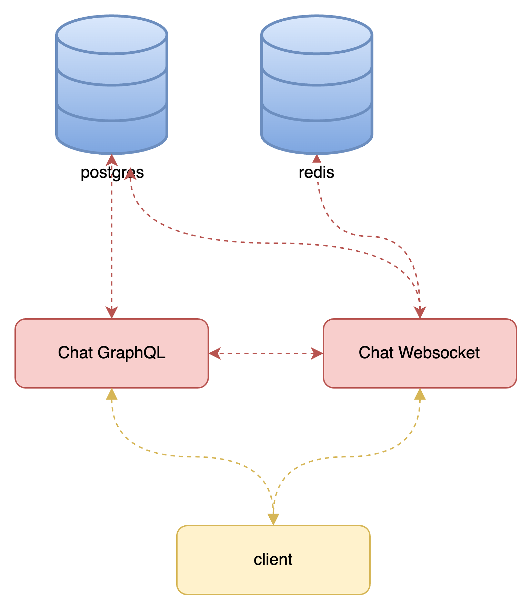

# chat-service 



## about services 
| service | port | databases | what it does |
|--|--|--|--|
| graphQL | 4000 | postgres | creates rooms and handles memberships |
| websocket | 8066 | postgres, redis | handles connections to rooms and sending and receiving messages |

## set up dependency containers
### create network 
```bash
docker network create gol_golang_network
```

### development
```bash
docker-compose -f docker-compose-develop.yml up -d  --build
docker-compose -f docker-compose-production.yml up -d  --build
```

**This will download and launch these containers:**
- postgres
- redis

## create postgres Database
### development
```bash
docker exec -it chat_postgres_dev  psql -U postgres -c 'create database "Dev_Messages"'
```

## For environment variables listed below, fill in the appropriate values based on your environment.

```bash
REDISCONNECTIONHOST=chat_redis_dev
REDISCONNECTIONPORT=6379
REDISCONNECTIONPASSWORD=
REDISCONNECTIONDB=0

POSTGRESQLROOMSHOST=chat_postgres_dev
POSTGRESQLROOMSPORT=5432
POSTGRESQLROOMSUSER=postgres
POSTGRESQLROOMSPASSWORD=
POSTGRESQLROOMSSSLMODE=disable
POSTGRESQLROOMSDBNAME=Dev_Messages
POSTGRESQLROOMSTABLE=rooms

POSTGRESQLMEMBERSHIPTABLE=membership

POSTGRESQLMESSAGESHOST=chat_postgres_dev
POSTGRESQLMESSAGESPORT=5432
POSTGRESQLMESSAGESUSER=postgres
POSTGRESQLMESSAGESPASSWORD=
POSTGRESQLMESSAGESSSLMODE=disable
POSTGRESQLMESSAGESDBNAME=Dev_Messages
POSTGRESQLMESSAGESTABLE=messages

JWTSECRET=

WSPORT=4000

GRAPHQLPORT=8066
```# chat-golang-ws-graphql
